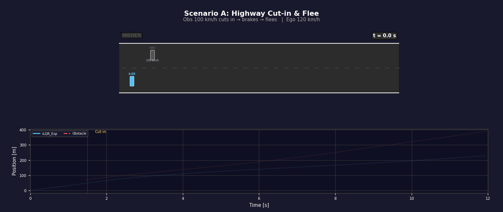
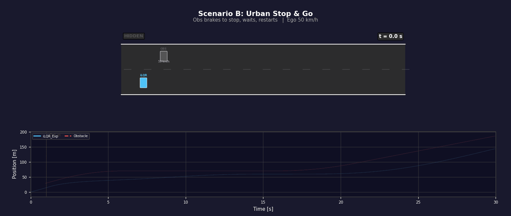
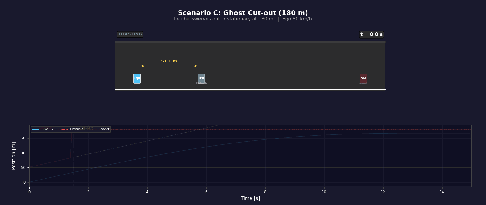
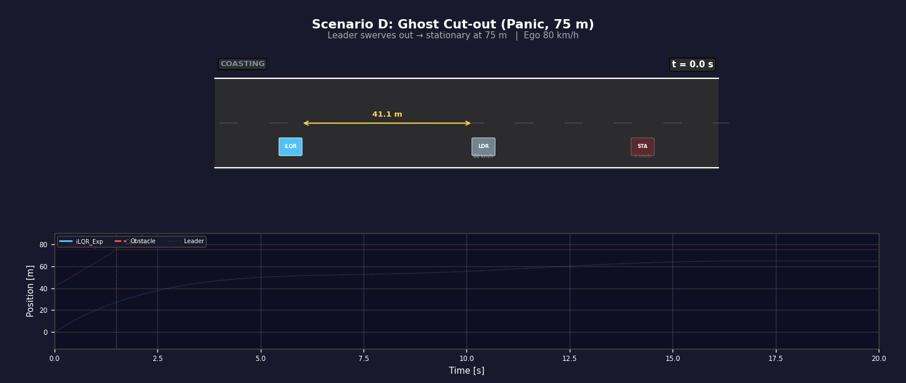
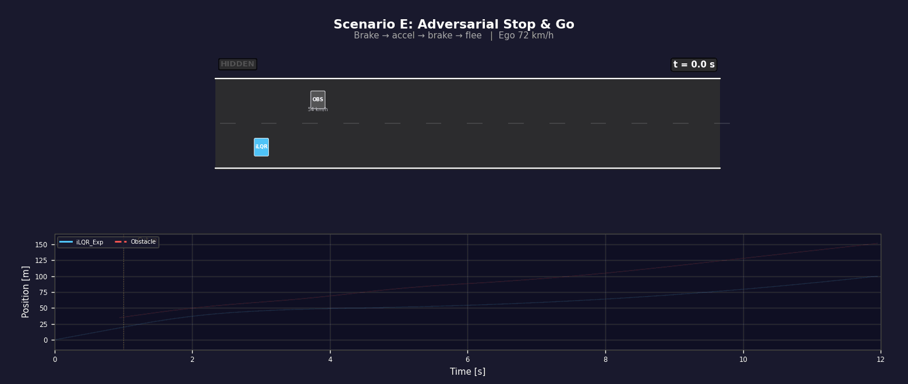

# Safe Longitudinal Planning

A simulation framework for benchmarking longitudinal planning and control algorithms under realistic disturbances (actuator delay, sensor noise, packet loss). Covers the full pipeline — from IDM-based reference generation (behavioral planning) through MPC trajectory optimization with safety constraints (local planning) to PID tracking control — and compares **8 algorithm variants** across **5 driving scenarios**, with a focus on safety constraint formulations.

## Motivation

Production longitudinal planning pipelines (e.g., DP + QP + PID) often perform well in simulation but degrade under real-world conditions: actuator delay causes tracking oscillation, sensor noise corrupts reference trajectories, and hard safety constraints lead to solver infeasibility during sudden cut-ins. This project systematically investigates these failure modes and evaluates how augmented-state MPC frameworks with different safety cost formulations can improve planning robustness in extreme scenarios.

## Approach: Progressive Architecture Evolution

The investigation follows a step-by-step evolution from a production baseline to an advanced safety-aware planner, where each step addresses a specific failure mode discovered in the previous stage:

```
Stage 0 (Baseline)       DP  →  QP Smoothing  →  PID Tracking
                         │         │                  │
                         │    acceleration        feedback
                         │    profile smoothing   control
                         │         │                  │
Problem discovered:      │    QP+PID cannot compensate 0.3s actuator delay
                         │    → tracking oscillation in real-vehicle tests
                         ▼
Stage 1 (Delay)          DP  →  MPC (Augmented State)
                         │         │
                         │    replaces QP+PID with a single MPC that
                         │    embeds the delay pipeline [u_{k-1},...,u_{k-τ}]
                         │    into its state-space model
                         │         │
Problem discovered:      │    pure tracking MPC has no obstacle awareness
                         │    → crashes in sudden cut-in scenarios
                         ▼
Stage 2 (Safety)         DP  →  MPC + Safety Constraints
                         │         │
                         │    adds RSS-based safety distance constraints
                         │    Hard constraints → infeasible under surprise cut-ins
                         │    Soft constraints (slack) → feasible but jerky
                         │         │
Problem discovered:      │    OSQP (QP solver) requires linear constraints
                         │    → safety cost must be piecewise, causing C⁰ kink
                         │    → discontinuous braking response
                         ▼
Stage 3 (Cost Shaping)   DP  →  MPC + Exponential Safety Cost (iLQR)
                                   │
                              switch from OSQP to iLQR solver, enabling
                              C∞ smooth exponential cost w·exp(g/L)
                              → anticipatory braking before boundary
                              → no derivative discontinuity for the solver
```

The three ablation dimensions in the benchmark (Delay, Safety, Cost Shaping) correspond directly to these stages, allowing controlled comparison at each step.

## Driving Scenarios

Five scenarios with distinct threat profiles, each using piecewise-constant acceleration with 0.3 s linear ramp transitions at phase boundaries for physically realistic jerk.

### Scenario A — Highway Cut-in & Flee

A vehicle at 100 km/h cuts into ego's lane (ego at 120 km/h), brakes, then accelerates past and departs.



### Scenario B — Urban Stop & Go

A vehicle cuts in at 50 km/h, brakes to a full stop, waits, then restarts.



### Scenario C — Ghost Cut-out (Far, 180 m)

Ego follows a lead vehicle at 80 km/h. The leader suddenly swerves out, revealing a stationary disabled vehicle 146 m ahead. 



### Scenario D — Ghost Cut-out (Panic, 75 m)

Same setup but the stationary obstacle is only 48 m ahead — forces emergency braking at the physical limit.



### Scenario E — Adversarial Stop & Go

Aggressive brake → accel → brake → flee sequence designed to break constant-velocity prediction models and stress-test jerk attenuation.



## Architecture

```
├── main.py                            # Entry point: 5 scenarios × 3 controller batches
│
├── core/                              # Core simulation framework
│   ├── __init__.py
│   ├── env.py                         # Vehicle dynamics, obstacle scenarios, IDM planner
│   ├── solvers.py                     # QP smoother, PID tracker, MPC-OSQP, MPC-iLQR, cost functions
│   ├── controllers.py                 # 8 pre-configured planning & control configurations
│   ├── experiments.py                 # Simulation runner, metrics computation
│   └── visualization.py              # Dashboard renderer (S-T, v-t, a-t, TTC⁻¹, radar)
│
├── analysis/                          # Standalone analysis & visualization scripts
│   ├── gen_scenario_gifs.py           # Animated GIF generator (single / compare modes)
│   ├── bayesian_opt.py                # Hyperparameter tuning (Optuna)
│   ├── disturbance_evolution.py       # 3-stage progressive disturbance experiment
│   ├── cbf_exp.py                     # CBF vs Exp vs Quad multiplier comparison
│   ├── plot_lambda_vs_h.py            # Four-formulation λ(h) analysis (4 figures)
│   ├── plot_safe_cost.py              # 3D cost landscape surfaces
│   ├── plot_3d_trajectories.py        # Trajectories overlaid on cost surfaces
│   └── plot_pareto.py                 # Pareto frontier sweep (comfort vs agility)
│
├── assets/gifs/                       # Generated scenario animations
├── requirements.txt
└── .gitignore
```

## Planning & Control Pipeline

The framework implements a three-layer pipeline and benchmarks 8 configurations across three ablation dimensions:

```
IDM Reference Generator  →  Local Planner (MPC / QP)  →  Tracking Controller (PID)
   (behavioral layer        (trajectory optimization       (low-level execution)
    replace DP, could        with safety constraints)
    be replaced by  
    Reinforcement Learning
    layer)
```

**Dimension A — Delay Mitigation** (How does the planner handle actuator delay?)

| Configuration | Delay Handling | Method |
|--------------|---------------|--------|
| `PID_Standard` | Blind (assumes 0 delay) | QP smoother + PID |
| `PID_Forward` | Kinematic forward simulation | QP smoother + PID |
| `MPC_NoAug_Track` | None | MPC-OSQP |
| `MPC_Aug_Track` | Augmented state matrix | MPC-OSQP |

**Dimension B — Safety Paradigm** (How are obstacle constraints enforced in the planner?)

| Configuration | Constraint Type | Behavior |
|--------------|----------------|----------|
| `MPC_Aug_Track` | None | Crashes into obstacle |
| `MPC_Aug_Hard` | Hard constraint | Solver infeasibility on sudden cut-ins |
| `MPC_Aug_Soft` | Soft (slack variables) | Survives but jerky response |

**Dimension C — Cost Shaping** (Does nonlinear cost in the planner improve comfort?)

| Configuration | Solver | Safety Cost | Smoothness |
|--------------|--------|------------|------------|
| `MPC_Aug_Soft` | OSQP (QP) | Linear + quadratic slack | C⁰ at boundary |
| `iLQR_Aug_Quad` | iLQR (DDP) | Quadratic penalty | C⁰ continuous, C¹ discontinuous |
| `iLQR_Aug_Exp` | iLQR (DDP) | Exponential (APF-inspired) | C∞ smooth everywhere |

## Key Technical Details

**Augmented state for delay compensation.** The actuator delay τ is modeled by extending the state vector to ξ = [x, v, u\_{k-1}, …, u\_{k-τ}]ᵀ, embedding the command pipeline into the state-space model so the MPC planner can optimize over commands already in flight.

**RSS-based safety distance.** The planner's safety distance is computed from RSS kinematics: d\_safe = d\_min + max(0, d\_ego\_stop − d\_obs\_stop), ensuring the ego can always stop in time under maximum braking.

**Exponential safety cost.** The cost w·exp(g/L) provides C∞ smooth anticipatory braking in the planning horizon — non-zero gradient everywhere. As L→0, the effective multiplier converges to the CBF's piecewise-linear response while maintaining solver-friendly smoothness.

**IDM reference generator with planner artifacts.** The behavioral layer uses IDM to simulate real DP planner behavior: distance-dependent perception noise, Doppler velocity noise, dual-mode acceleration quantization, Zero-Order Hold at 5 Hz, and stochastic packet loss (5%).

## Evaluation Metrics

| Metric | Category | Description |
|--------|----------|-------------|
| Min Distance | Safety | Closest approach to obstacle |
| Danger Time | Safety | Cumulative time with TTC < 3 s |
| Max Jerk | Comfort | Peak absolute jerk |
| Jerk RMS | Comfort | RMS jerk over the run |
| Tracking RMSE | Efficiency | RMS velocity tracking error |
| Compute Time | Feasibility | Mean solver wall-clock time |

## Usage

### Install

```bash
pip install -r requirements.txt
```

### Run the full benchmark

```bash
python main.py
```

Executes 5 scenarios × 3 controller batches = 15 dashboard plots.

### Generate scenario animations

```bash
# For README (1 controller per scenario):
python analysis/gen_scenario_gifs.py --mode single

# For presentation (3 ablation batches × 5 scenarios):
python analysis/gen_scenario_gifs.py --mode compare

# Single scenario + single batch:
python analysis/gen_scenario_gifs.py --mode compare --scenario D --batch 3
```

### Run analysis scripts

```bash
python analysis/disturbance_evolution.py     # 3-stage disturbance experiment
python analysis/bayesian_opt.py              # Hyperparameter optimization (Optuna)
python analysis/cbf_exp.py                   # CBF vs Exp vs Quad multiplier figure
python analysis/plot_lambda_vs_h.py          # λ(h) analysis (4 figures)
python analysis/plot_safe_cost.py            # 3D cost landscapes
python analysis/plot_3d_trajectories.py      # Trajectories on cost surfaces
python analysis/plot_pareto.py               # Pareto frontier sweep
```

## License

This project is for research and educational purposes.
