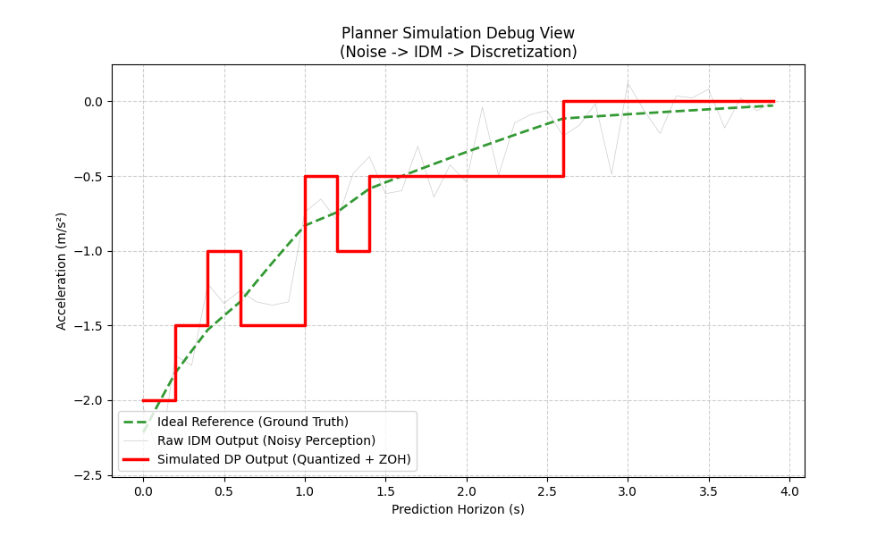
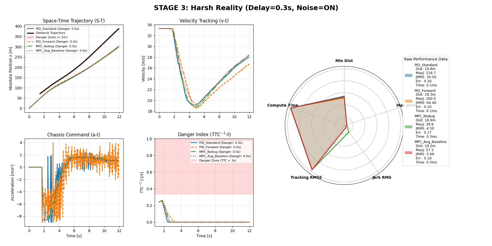
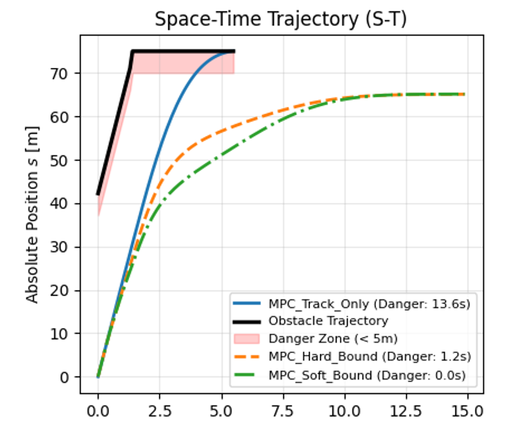
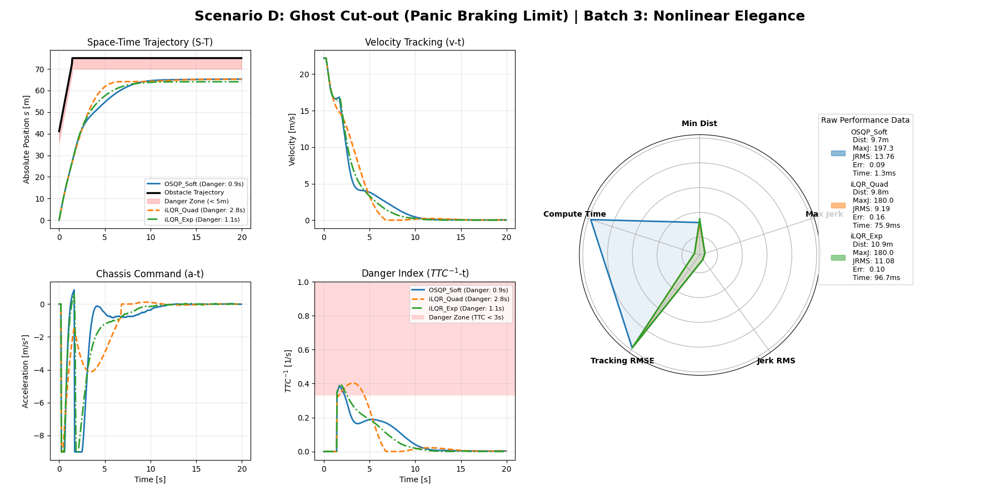
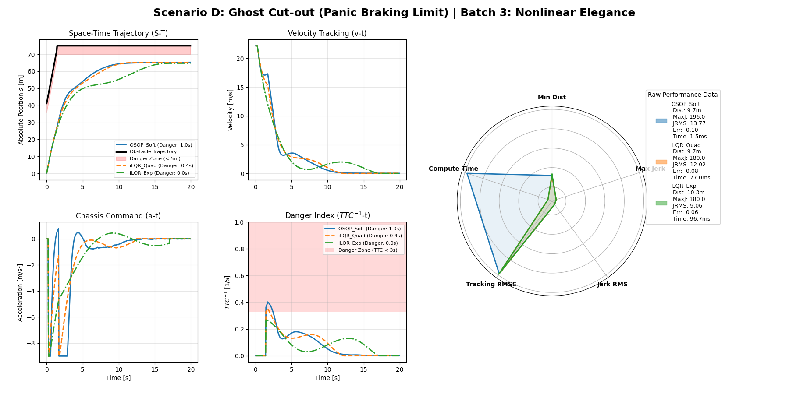

# Safe Longitudinal Planning

A simulation framework for benchmarking longitudinal planning and control under realistic disturbances (actuator delay, sensor noise, planner timeout). Covers the full pipeline — from IDM-based reference generation through MPC trajectory optimization with safety constraints to PID tracking control — and compares **8 algorithm variants** across **5 driving scenarios**.

## Motivation

Production longitudinal planning pipelines (DP + QP + PID) are computationally efficient but exhibit systematic failures under aggressive cut-in scenarios with realistic system latency (0.3 s), perception noise, and planner timeout: oscillatory braking, insufficient deceleration, and delayed response. These are not tuning deficiencies but structural limitations — the planner has no knowledge of the system's delay, and the controller has no awareness of the planner's safety intent.

## Approach: Progressive Architecture Evolution

Starting from the production baseline, one component is replaced at a time. Each step addresses a specific failure mode discovered in the previous stage, and every change is evaluated under identical disturbance conditions.

```
Stage 0 (Baseline)       DP  →  QP Smoothing  →  PID Tracking
                         │
Problem discovered:      │    QP+PID cannot compensate 0.3s actuator delay
                         │    → tracking oscillation under delay + noise
                         ▼
Stage 1 (Delay)          DP  →  MPC (Augmented State)
                         │         replaces QP+PID; embeds the delay pipeline
                         │         [u_{k-1},...,u_{k-τ}] into the state-space model
                         │
Problem discovered:      │    pure tracking MPC has no obstacle awareness
                         │    → crashes in sudden cut-in scenarios
                         ▼
Stage 2 (Safety)         DP  →  MPC + Safety Constraints
                         │         adds RSS-based safety distance constraints
                         │         Hard → infeasible under surprise cut-ins
                         │         Soft (slack) → feasible but jerky
                         │
Problem discovered:      │    QP solver freezes d_safe(v) over the horizon
                         │    → cannot capture velocity–safety coupling
                         │    → piecewise penalty causes gradient discontinuity
                         ▼
Stage 3 (Cost Shaping)   DP  →  MPC + Exponential Safety Cost (iLQR)
                                   switch from OSQP to iLQR solver, enabling
                                   C∞ smooth exponential cost w·exp(g/L)
                                   → anticipatory braking before boundary
                                   → iLQR recalculates d_safe(v) at each step
```

### Stage 0 → 1: Reference trajectory degradation and delay compensation

The IDM planner (replacing DP in simulation) introduces realistic artifacts: distance-dependent position noise, velocity measurement noise, dual-mode acceleration quantization, Zero-Order Hold at 5 Hz, and stochastic planner timeout (5%). The downstream tracker must handle this degraded reference under 0.3 s actuator delay.

<!-- Figure: IDM planner debug output showing ideal → noisy → quantized → ZOH degradation -->
<!-- Source: run main.py, screenshot the first plot from demo_planner.plot_debug() -->
<p align="center"></p>

MPC with augmented state absorbs delay and noise through its prediction horizon, reducing jerk RMS by an order of magnitude vs PID (97 → 5.5 m/s³).

<!-- Figure: Batch 1 (Delay Immunity) in Scenario A — velocity subplot -->
<!-- Source: run main.py, screenshot the v-t subplot from "Scenario A | Batch 1: Delay Immunity" -->
<p align="center"></p>

### Stage 1 → 2: Adding safety constraints

Without safety constraints, MPC follows the reference into collision when the reference is wrong (e.g., ghost cut-out). Hard constraints cause solver infeasibility under surprise cut-ins. Soft constraints (slack variables) guarantee feasibility but produce jerky response due to the penalty's gradient discontinuity at the safety boundary.

<!-- Figure: Batch 2 (Constraint Paradigm) in Scenario D — S-T or v-t subplot -->
<!-- Source: run main.py, screenshot the S-T subplot from "Scenario D | Batch 2: Constraint Paradigm" -->
<p align="center"></p>

### Safety distance model: time-gap vs RSS

The safety function d_safe matters as much as the cost function. A fixed time-gap model (d_safe = s₀ + T·v) ignores relative kinematics — it overreacts at high speed and underreacts near standstill. The RSS-based kinematic model (accounting for ego reaction time and both vehicles' braking distances) triggers earlier, brakes more gradually, and eliminates the braking oscillation caused by abrupt constraint activation.

<!-- Source: your report Figure 4.1 (upper) and Figure 4.2 (lower), both Scenario D Batch 3 -->
<p align="center">
<br>
<sub>Time-gap safety model: even iLQR Exp spends 1.1 s in danger zone</sub>
</p>
<p align="center">
<br>
<sub>RSS safety model: iLQR Exp achieves 0.0 s danger time</sub>
</p>

Switching from time-gap to RSS with the same controller (iLQR Exp) reduced danger time from 1.1 s to 0.0 s — a larger improvement than switching from quadratic to exponential cost with the same safety function.

### Stage 2 → 3: Exponential cost with iLQR

Switching from OSQP to iLQR enables two improvements: the solver recalculates the velocity-dependent safety distance d_safe(v) at each backward-pass step (capturing the coupling that QP must freeze), and the C∞ smooth exponential cost provides anticipatory braking before the safety boundary is reached.

As shown in the RSS comparison above (right panel), in the most demanding scenario (ghost cut-out at 75 m), iLQR with exponential cost is the only configuration that achieves **0.0 s danger time**, while OSQP Soft spends 1.0 s and iLQR Quad spends 0.4 s in the danger zone.

## Key Findings

Across 8 configurations × 5 scenarios under identical disturbances (0.3 s delay, perception noise, 5% planner timeout):

**1. MPC over PID.** Jerk RMS drops by an order of magnitude (97 → 5.5 m/s³). PID with forward prediction performs *worse* than standard PID under delay+noise — open-loop delay compensation with an inaccurate model amplifies rather than attenuates disturbances.

**2. Safety constraints: insurance policy.** Redundant in benign scenarios (all controllers achieve 0.0 s danger time), decisive at the physical limit (Scenario D: danger time ranges from 2.3 s without safety to 0.0 s with exponential cost).

**3. Exponential cost advantage is concentrated at the physical boundary.** In Scenario D, iLQR Exp achieves 0.0 s danger time vs 0.4 s (iLQR Quad) and 1.0 s (OSQP Soft). In benign scenarios, the differences are negligible.

**4. Safety boundary design matters as much as cost shape.** Switching from fixed time-gap to RSS-based d_safe — without changing the controller — reduced danger time from 1.1 s to 0.0 s. A larger improvement than switching cost functions alone.

**5. Solver structure matters independently of cost shape.** iLQR Quad outperforms OSQP Soft (0.4 s vs 1.0 s) despite similar quadratic penalty shapes, because iLQR captures the velocity–safety-distance coupling that QP solvers must freeze within the horizon.

### Scenario D Results (Ghost Cut-out, Panic Braking Limit)

| Configuration | Min Dist | Jerk RMS | Tracking Err | Danger Time |
|--------------|----------|----------|-------------|-------------|
| PID Standard | 10.0 m | 27.6 | 0.13 | 1.9 s |
| PID Forward | 2.9 m | 45.2 | 0.17 | 3.8 s |
| MPC Aug (no safety) | 9.6 m | 4.2 | 0.14 | 2.3 s |
| MPC Hard | 9.7 m | 16.9 | 0.11 | 1.5 s |
| MPC Soft | 9.7 m | 13.8 | 0.10 | 1.0 s |
| iLQR Quad | 9.7 m | 12.0 | 0.08 | 0.4 s |
| **iLQR Exp** | **10.3 m** | **9.1** | **0.06** | **0.0 s** |

## Analytical Framework

Four safety formulations (CBF hard constraint, quadratic penalty, log barrier, exponential penalty) are placed in a unified optimization framework. All four produce u* = λ·G, where λ is the effective multiplier and G the control sensitivity. The formulations differ entirely in how λ depends on the safety margin h. Three properties explain the experimental hierarchy:

- **Anticipation:** whether λ > 0 when the system is still safe (h > 0). CBF and quadratic provide zero gradient; exponential and log barrier do not.
- **Recovery strength:** how fast λ grows under constraint violation (h < 0). Log barrier is most aggressive (singularity), exponential is strong (exponential growth), quadratic is moderate (linear growth), CBF is gradual (fixed fraction per step).
- **Smoothness:** compatibility with Newton-type solvers. CBF has a C⁰ kink, quadratic is C¹ (Hessian jumps), log barrier is C∞ but undefined for h ≤ 0, exponential is C∞ everywhere.

The exponential penalty is the only formulation that simultaneously provides anticipation, C∞ smoothness, full-domain definition, and strong recovery.

## Driving Scenarios

Five scenarios with distinct threat profiles. Cut-in and adversarial scenarios use linear acceleration ramps (10–15 m/s³ jerk limit) at phase transitions; ghost cut-out scenarios feature constant-velocity leader dynamics and a stationary obstacle.

### Scenario A — Highway Cut-in & Flee

A vehicle at 100 km/h cuts into ego's lane (ego at 120 km/h), brakes, then accelerates past and departs.

<p align="center"></p>

### Scenario B — Urban Stop & Go

A vehicle cuts in at 50 km/h, brakes to a full stop, waits, then restarts.

<p align="center"></p>

### Scenario C — Ghost Cut-out (Far, 146 m)

Ego follows a lead vehicle at 80 km/h. The leader suddenly swerves out, revealing a stationary disabled vehicle 146 m ahead.

<p align="center"></p>

### Scenario D — Ghost Cut-out (Panic, 48 m)

Same setup but the stationary obstacle is only 48 m ahead — forces emergency braking at the physical limit.

<p align="center"></p>

### Scenario E — Adversarial Stop & Go

Aggressive brake → accel → brake → flee sequence designed to stress-test jerk attenuation.

<p align="center"></p>

## Architecture

```
├── main.py                            # Entry point: 5 scenarios × 3 controller batches
│
├── core/                              # Core simulation framework
│   ├── __init__.py
│   ├── env.py                         # Vehicle dynamics, obstacle scenarios, IDM planner
│   ├── solvers.py                     # QP smoother, PID tracker, MPC-OSQP, MPC-iLQR, cost functions
│   ├── controllers.py                 # 8 pre-configured planning & control configurations
│   ├── experiments.py                 # Simulation runner, metrics computation
│   └── visualization.py               # Dashboard renderer (S-T, v-t, a-t, TTC⁻¹, radar)
│
├── analysis/                          # Standalone analysis & visualization scripts
│   ├── gen_scenario_gifs.py           # Animated GIF generator (single / compare modes)
│   ├── bayesian_opt.py                # Hyperparameter tuning (Optuna)
│   ├── disturbance_evolution.py       # 3-stage progressive disturbance experiment
│   ├── cbf_exp.py                     # CBF vs Exp vs Quad multiplier comparison
│   ├── plot_lambda_vs_h.py            # Four-formulation λ(h) analysis (4 figures)
│   ├── plot_safe_cost.py              # 3D cost landscape surfaces
│   ├── plot_3d_trajectories.py        # Trajectories overlaid on cost surfaces
│   └── plot_pareto.py                 # Pareto frontier sweep (comfort vs agility)
│
├── assets/
│   ├── gifs/                          # Scenario animations
│   └── figures/                       # Result screenshots from main.py
├── requirements.txt
└── .gitignore
```

## Planning & Control Pipeline

The framework implements a three-layer pipeline and benchmarks 8 configurations across three ablation dimensions:

```
IDM Reference Generator  →  Local Planner (MPC / QP)  →  Tracking Controller (PID)
  (behavioral layer,          (trajectory optimization       (low-level execution)
   replaces DP in              with safety constraints)
   simulation)
```

**Dimension A — Delay Mitigation** (How does the planner handle actuator delay?)

| Configuration | Delay Handling | Method |
|--------------|---------------|--------|
| `PID_Standard` | Blind (assumes 0 delay) | QP smoother + PID |
| `PID_Forward` | Kinematic forward simulation | QP smoother + PID |
| `MPC_NoAug_Track` | None | MPC-OSQP |
| `MPC_Aug_Track` | Augmented state matrix | MPC-OSQP |

**Dimension B — Safety Paradigm** (How are obstacle constraints enforced in the planner?)

| Configuration | Constraint Type | Behavior |
|--------------|----------------|----------|
| `MPC_Aug_Track` | None | Crashes into obstacle |
| `MPC_Aug_Hard` | Hard constraint | Solver infeasibility on sudden cut-ins |
| `MPC_Aug_Soft` | Soft (slack variables) | Survives but jerky response |

**Dimension C — Cost Shaping** (Does nonlinear cost in the planner improve comfort?)

| Configuration | Solver | Safety Cost | Effective Response at Boundary |
|--------------|--------|------------|-------------------------------|
| `MPC_Aug_Soft` | OSQP (QP) | Linear + quadratic slack | Gradient jump (linear term causes sudden braking onset) |
| `iLQR_Aug_Quad` | iLQR | Quadratic penalty | Gradient continuous, Hessian jumps (zero response in safe region) |
| `iLQR_Aug_Exp` | iLQR | Exponential (APF-inspired) | C∞ smooth (non-zero anticipatory response everywhere) |

## Key Technical Details

**Augmented state for delay compensation.** The actuator delay τ is modeled by extending the state vector to ξ = [x, v, u\_{k-1}, …, u\_{k-τ}]ᵀ, embedding the command pipeline into the state-space model so the MPC planner can optimize over commands already in flight.

**RSS-based safety distance.** The planner's safety distance follows RSS kinematics with reaction delay:

```
d_ego_stop = v_ego × t_ρ + v_ego² / (2 × a_max)     (includes reaction time t_ρ)
d_obs_stop = v_obs² / (2 × a_max)                     (obstacle brakes immediately)
d_safe     = d_min + max(0, d_ego_stop − d_obs_stop)
```

This ensures the ego can always stop in time even accounting for reaction delay, using the same maximum braking capability `a_max` for both vehicles.

**Exponential safety cost.** The cost w·exp(g/L) provides C∞ smooth anticipatory braking in the planning horizon — non-zero gradient everywhere, including in the safe region. As L→0, the effective multiplier converges to the CBF's piecewise-linear response while maintaining solver-friendly smoothness. Exponent clipping (`np.clip(g/L, -20, 10)`) prevents numerical overflow. Gauss-Newton Hessian approximation and Tikhonov regularization (eigenvalue correction when Q\_uu becomes non-positive-definite) stabilize the iLQR backward pass.

**IDM reference generator with planner artifacts.** The behavioral layer uses IDM to simulate real DP planner behavior: distance-dependent position noise (base σ + 2% of range), velocity measurement noise, dual-mode acceleration quantization (fine grid for normal braking, coarse grid for panic braking), Zero-Order Hold between planning frames (5 Hz), and stochastic planner timeout / frame drop (5% probability, holds previous command).

## Evaluation Metrics

| Metric | Category | Description |
|--------|----------|-------------|
| Min Distance | Safety | Closest approach to obstacle |
| Danger Time | Safety | Cumulative time with TTC < 3 s |
| Max Jerk | Comfort | Peak absolute jerk |
| Jerk RMS | Comfort | RMS jerk over the run |
| Tracking RMSE | Efficiency | RMS velocity tracking error |
| Compute Time | Feasibility | Mean solver wall-clock time |

## Usage

### Install

```bash
pip install -r requirements.txt
```

### Run the full benchmark

```bash
python main.py
```

Executes 5 scenarios × 3 controller batches = 15 dashboard plots.

### Generate scenario animations

```bash
# For README (1 controller per scenario):
python analysis/gen_scenario_gifs.py --mode single

# For presentation (3 ablation batches × 5 scenarios):
python analysis/gen_scenario_gifs.py --mode compare

# Single scenario + single batch:
python analysis/gen_scenario_gifs.py --mode compare --scenario D --batch 3
```

### Run analysis scripts

```bash
python analysis/disturbance_evolution.py     # 3-stage disturbance experiment
python analysis/bayesian_opt.py              # Hyperparameter optimization (Optuna)
python analysis/cbf_exp.py                   # CBF vs Exp vs Quad multiplier figure
python analysis/plot_lambda_vs_h.py          # λ(h) analysis (4 figures)
python analysis/plot_safe_cost.py            # 3D cost landscapes
python analysis/plot_3d_trajectories.py      # Trajectories on cost surfaces
python analysis/plot_pareto.py               # Pareto frontier sweep
```

## Future Directions

- Replace the IDM behavioral layer with a learned policy (e.g., reinforcement learning) while retaining the MPC safety layer as a downstream filter
- Tighter uncertainty quantification for MPC constraint tightening
- Learned cost functions for adaptive safety constraints
- Integration as a safety fallback layer for end-to-end planners

## License

This project is for research and educational purposes.
